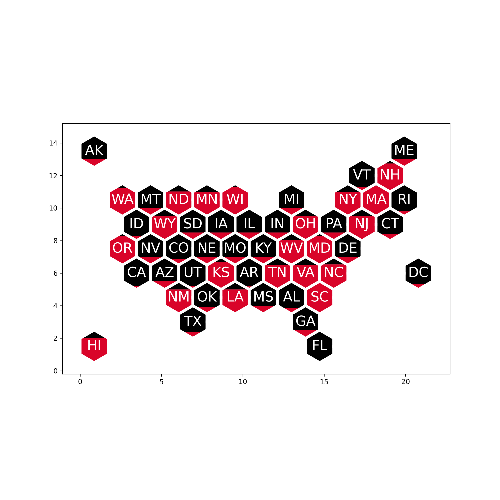

# Lone Wolf
The fabulous (soon to be) package that builds out a United States hex map optional hex filling

## Install
`git clone ___`
`python setup.py install`

## Usage
`lone-wolf plot-hex static/demo_input1.csv`

Special Credits to Kevin Arvai and Gregory Michaelson because they are heroes