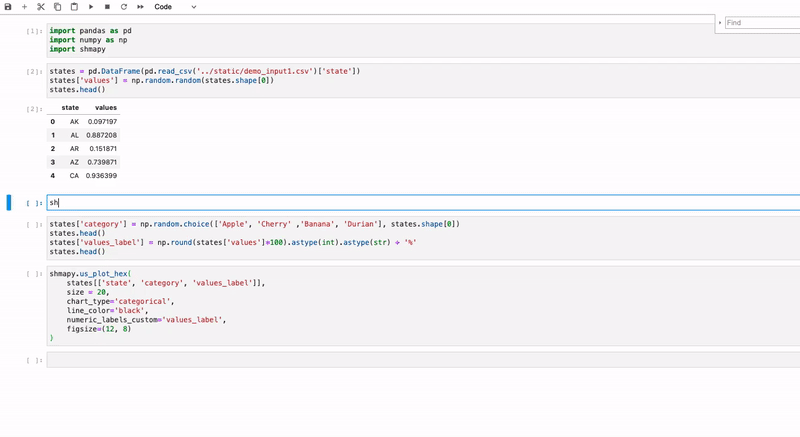
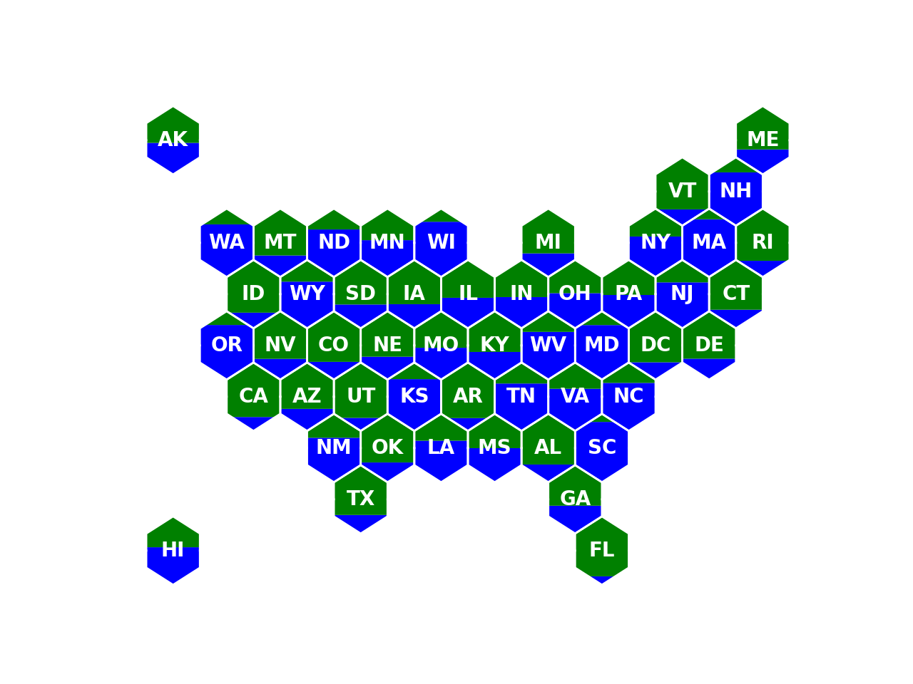
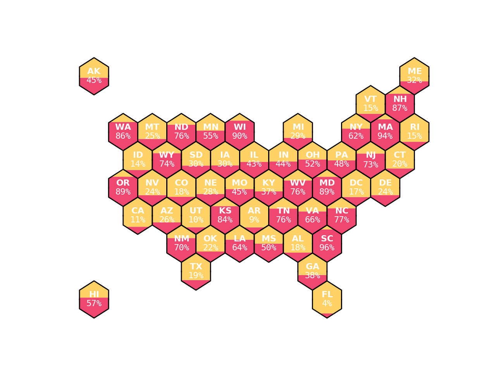
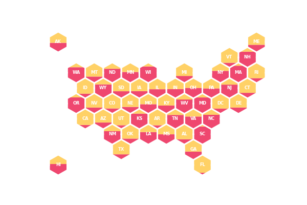
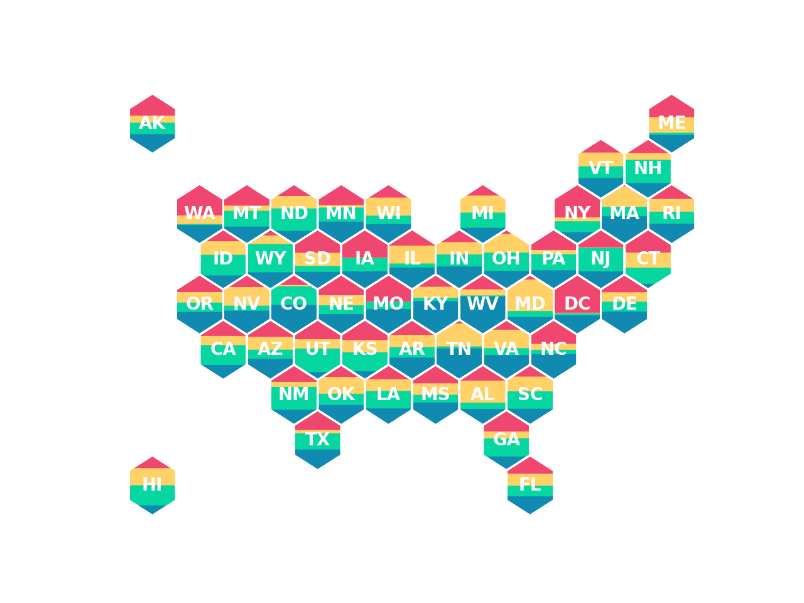
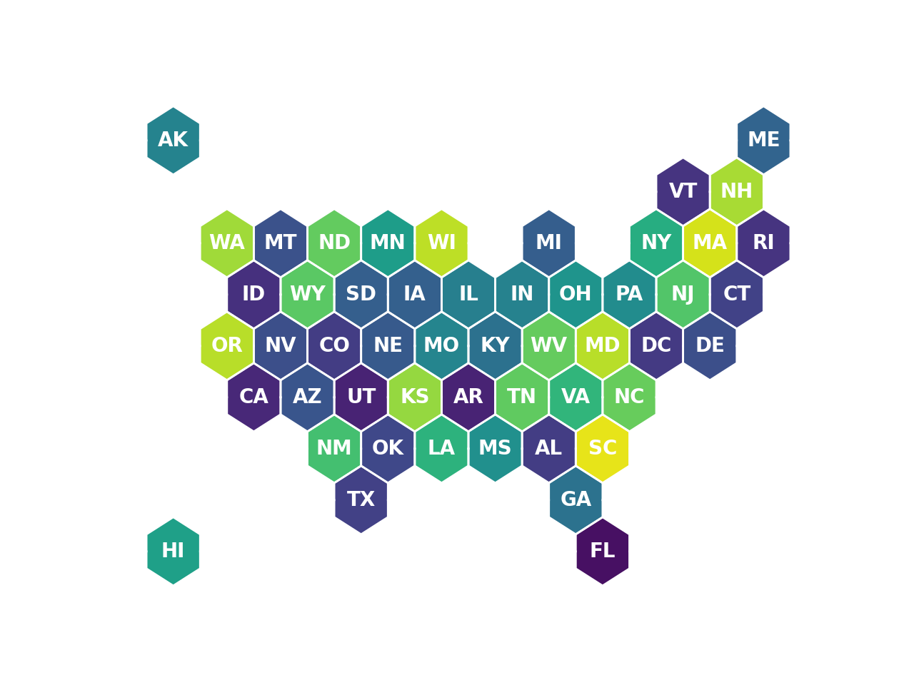
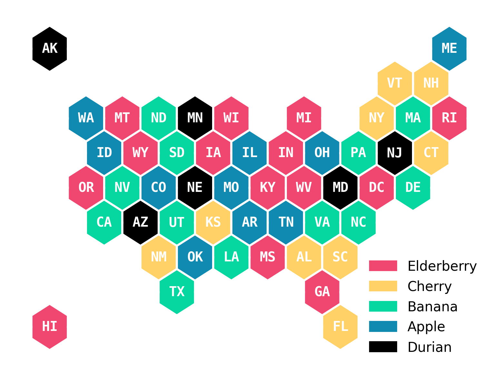
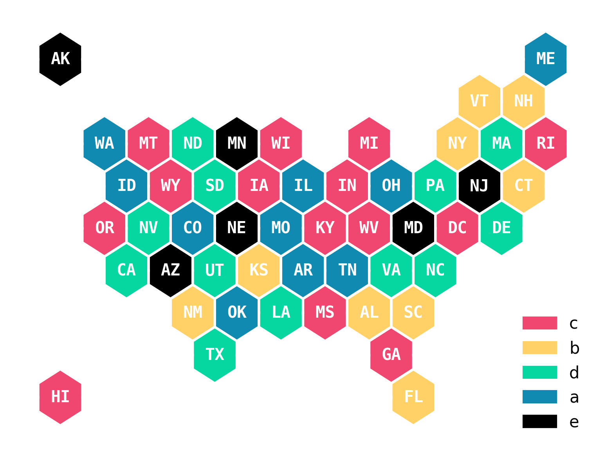

# Shmapy
[](https://codecov.io/gh/mpkrass7/shmapy)

The fabulous package for build hex maps and facet maps

## Install

Install from source:  
`git clone git@github.com:mpkrass7/shmapy.git`  
`python setup.py install` 

## It's easy to Shmap


## Usage

```bash
head -10 shmapy/static/demo_input1.csv

AK,0.448415868
AL,0.178259515
AR,0.094003348
AZ,0.263422391
CA,0.110670893
CO,0.179617281
CT,0.1960641
DC,0.171112619
DE,0.241586764
FL,0.040757232
```

Play with colors

`shmapy plot-hex --fill_color="['blue','green']" --category_labels=Positive,Negative shmapy/static/demo_input1.csv`



Add percent fill labels to the plot automatically

`shmapy plot-hex --numeric_labels=all --size=8 shmapy/static/demo_input1.csv`



Resize plot (**kwargs get passed to matplotlib.pyplot.subplots())

`shmapy plot-hex --size=3 --figsize="(3,2)" shmapy/static/demo_input1.csv`



Plot more than two colors

`shmapy plot-hex shmapy/static/demo_input3.csv`



Plot a choropleth

`shmapy plot-hex --chart_type="choropleth" --choropleth_axis_label="Positivity" shmapy/static/demo_input1.csv`




Plot a category using categories defined in the input file
`shmapy plot-hex --chart_type="categorical" shmapy/static/demo_input5.csv`



Plot a category but override the category names to user-defined category labels
`shmapy plot-hex --chart_type="categorical" --category_labels=a,b,c,d,e shmapy/static/demo_input5.csv`




## Input Dataframe

shmapy takes an input dataframe with at least two columns. The first column is
assumed to contain two-letter, capitalized state abbreviations or full state 
names with the first letter capitalized. The second column contains the numerical
values to map. These can be floats or lists of floats.
Optional additional columns:
numeric_labels_custom: the user can supply a column with values to be use as
custom numeric labels. The title of the column should be provided as the value for
the 'numeric_labels_custom' argument. 

## Options

chart_type: 'vbar' or 'choropleth'. Default is vbar.
  vbar: vertical bar. Each hexagon will consist of a vertical bar chart. If the
user submits a single float or length-1 list in each row of the values column
of the input dataframe, the values are scaled such that  min(value)=0 and 
max(value)=1. These values are interpreted as the lower segment of a 
2-segment bar chart indicating e.g. a percent completion. If the user submits
lists with multiple values in each row of the input dataframe, each list will
be rescaled such that the values sum to 1, and will be interpreted as multiple
segments of a stacked bar chart.
  choropleth: choropleth map. Each hexagon will be fully shaded as a single
color from a colormap. Each row of the values column must contain a single
numerical value or length-1 list. The values are scaled such that min(value)=0
and max(value)=1, then used to select a shade from a colormap.
  category: TO BE IMPLEMENTED

color: list of colors for vbar or category maps. Default is ["#ef476f", "#ffd166", 
"#06d6a0", "#118ab2"]. Any color intelligible by pyplot is acceptable (hex code, 
color name, RGB or RGBA tuples, etc). See 
https://matplotlib.org/stable/api/colors_api.html
 
colormap: colormap for shading of choropleth maps. Default is 'viridis'. Takes 
names of standard pyplot colormaps. See 
https://matplotlib.org/stable/gallery/color/colormap_reference.html

line_color: colors the outline of the hexagons. Default is '#ffffff'. Any color 
intelligible by pyplot is acceptable (hex code, color name, RGB or RGBA tuples, 
etc). See https://matplotlib.org/stable/api/colors_api.html 

numeric_labels_custom: the name of a column in the input dataframe containing
custom numeric labels for the states. Default None. A numeric custom label replaces
the standard numeric label and is positioned under the state name.


**Special Credits to Kevin Arvai for building the real infrastructure on this package and Gregory Michaelson for figuring out everything hexagon**

## To Do Items:
- Users can supply a categorical fill
- Users can optionally exclude states (filling in an arbitrary color)
- Users can supply custom cooridnates for the hexagons -- Done
- Users can fill hexagons on a gradient -- Done
- Users have **kwargs access to plot output to optionally include axes, title etc.. -- Some Kwargs are here!
- Users can customize which states are filled
- Users can supply values underneath state label -- Done
- Flexibility around state name or abbrev capitalization
- Flexibility around number of states provided
