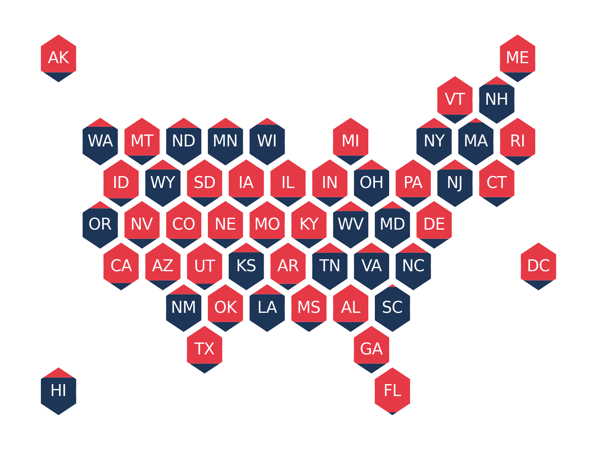
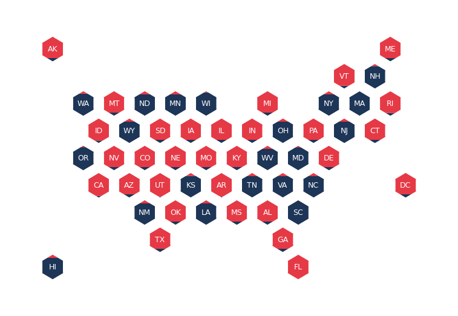

# Lone Wolf
The fabulous (soon to be) package for building a United States hex map with optional hex filling.

## Install

Install from source: 
`git clone git@github.com:mpkrass7/lone_wolf.git`  
`python setup.py install` 

## Usage

```bash
head -10 lone_wolf/static/demo_input1.csv

AK,0.448415868
AL,0.178259515
AR,0.094003348
AZ,0.263422391
CA,0.110670893
CO,0.179617281
CT,0.1960641
DC,0.171112619
DE,0.241586764
FL,0.040757232
```

`lone_wolf plot-hex static/demo_input1.csv`



`lone_wolf plot-hex static/demo_input1.csv -numeric_labels=all -size=8`


Resizse plot (**kwargs get passed to matplotlib.pyplot.subplots())

`lone_wolf plot-hex static/demo_input1.csv -size=3 -figsize="(3,2)"`



**Special Credits to Kevin Arvai for building the real infrastructure on this package and Gregory Michaelson for figuring out everything hexagon**

## To Do Items:
- Users can fill hexagons with constant color rather than percent fill
- Users can supply custom cooridnates for the hexagons -- Done
- Users can fill hexagons on a gradient
- Users have **kwargs access to plot output to optionally include axes, title etc.. -- Some Kwargs are here!
- Users can customize which states are filled
- Users can supply values underneath state label -- Done