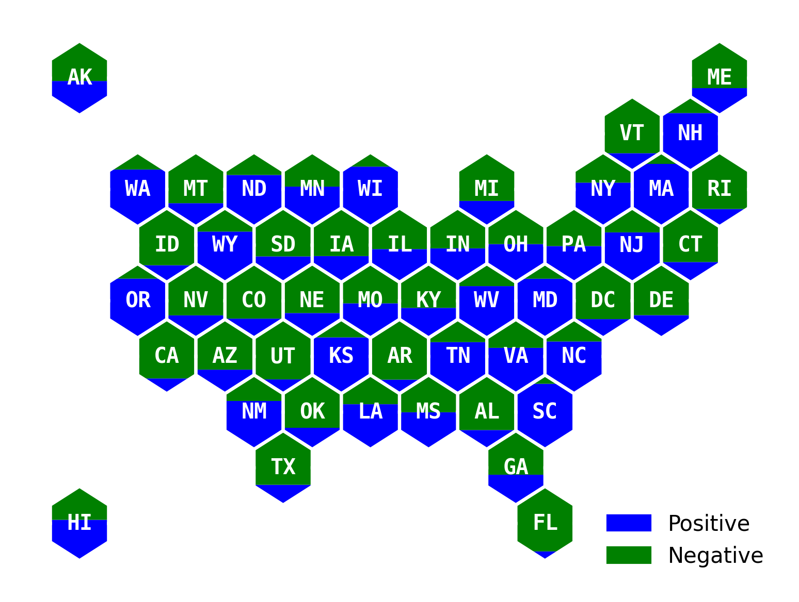
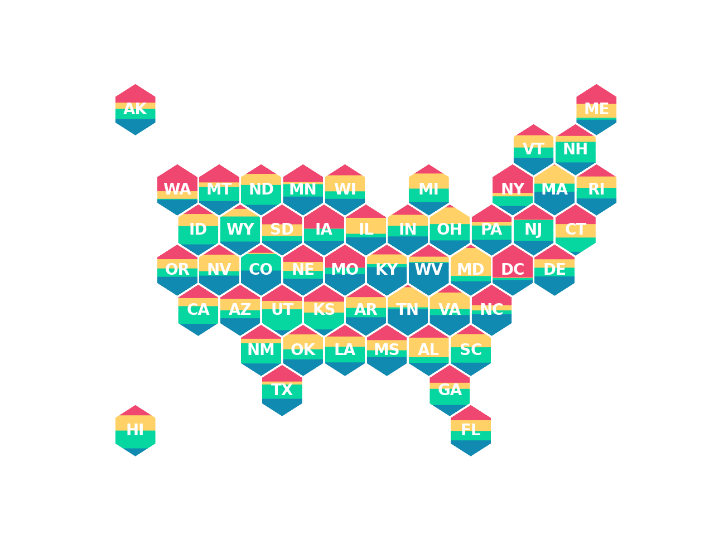
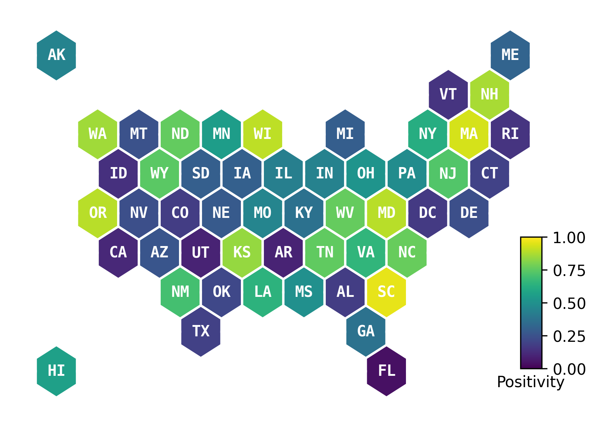

# Using Shmapy on the command line
It's easy to use Shmapy right on the command line. We do it all the time.

```bash
head -10 shmapy/static/demo_input1.csv

AK,0.448415868
AL,0.178259515
AR,0.094003348
AZ,0.263422391
CA,0.110670893
CO,0.179617281
CT,0.1960641
DC,0.171112619
DE,0.241586764
FL,0.040757232
```

## Customize fill colors

`shmapy plot-hex --fill_color="['blue','green']" --category_labels=Positive,Negative shmapy/static/demo_input1.csv`



## Add percent fill labels to the plot automatically

`shmapy plot-hex --chart_type="vbar" --numeric_labels=all --size=8 --line_color='black' shmapy/static/demo_input1.csv`


## Resize plot (**kwargs get passed to matplotlib.pyplot.subplots())

`shmapy plot-hex --size=3 --figsize="(3,2)" shmapy/static/demo_input1.csv`


## Plot more than two colors

`shmapy plot-hex shmapy/static/demo_input3.csv`



## Plot a choropleth

`shmapy plot-hex --chart_type="choropleth" --choropleth_axis_label="Positivity" shmapy/static/demo_input1.csv`




## Plot a category using categories defined in the input file
`shmapy plot-hex --chart_type="categorical" shmapy/static/demo_input5.csv`


## Plot a category but override the category names to user-defined category labels
`shmapy plot-hex --chart_type="categorical" --category_labels=a,b,c,d,e shmapy/static/demo_input5.csv`


